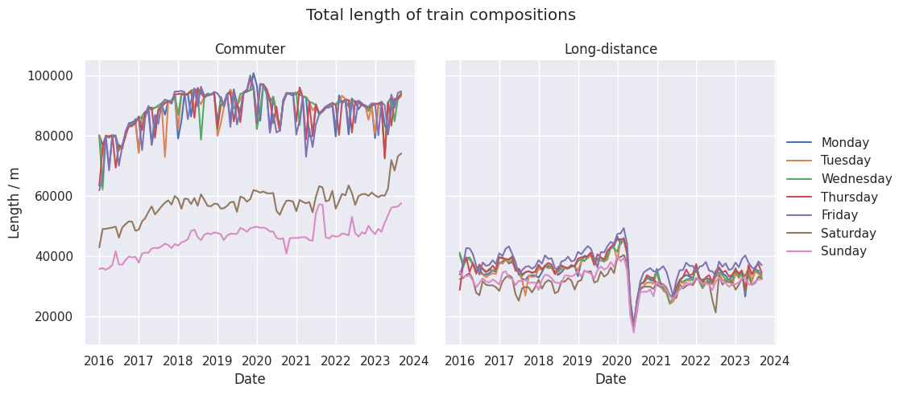

# ARIMA timeseries
Learn about model selection and training of ARIMA model family. The advantage of ARIMA models over neuronal nets is, that training can be automated more easily and thus, a much bigger amount of timeseries can be forecasted in same time.

# Description
This repository offers a [Jupyter-Notebook](Fitting_ARIMA.ipynb), in which ARIMA models can be fitted to time series data. To achieve this, a class is provided, which runs a AutoARIMA-process, to automatically determine the hyperparameters of the ARIMA model, see [Docs on pmdarima](https://alkaline-ml.com/pmdarima/modules/generated/pmdarima.arima.auto_arima.html). The data is downloaded from [digitraffic.fi ](https://www.digitraffic.fi/) and aggregated to 14 timeseries. A plot of these can be seen below. If you run the main.py, APIs are provided, which allow to receive the predictions from the trained model. 

# How to
Clone this repository and run `uvicorn main:app`. On your localhost on port 8000, you can check out the APIs providing the predictions of the ARIMA model in the swagger docs. These are accessible on endpoint /docs.  
Check out the notebook for statistical analysis of the predictions, as well.

# Contribute
Possible contributions may be:
- Use of database for data and automation of data update
- Deployment of the API app

To contribute, follow the steps
 |Steps|
 |:----------------------|
 |- Fork this repository|
 |- Clone your repository|
 |- Code and test your contribution|
 |- Commit and push|
 |- Create Pull request|
 |- Wait for merge|
